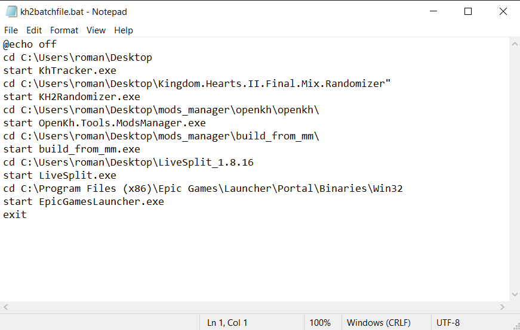
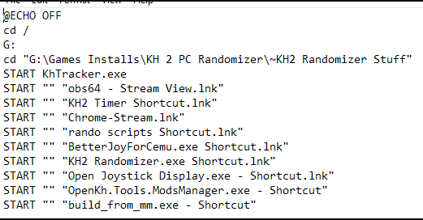

# KH2FM-Rando-Launcher
The KH2FM Rando Launcher is a simple way to open all of the necessary components for KH2 rando all at once. 

Upon a successful setup, double clicking your .bat file will launch the following all at once:

1. KHTracker
2. Livesplit
3. Seed Generator
4. Mods Manager

# Instructions

1. Go to releases and download the .bat file.
2. Move this .bat file to a place you can find it. I personally keep it on my desktop since I play rando a lot.
3. Right click on the .bat file and hit "Edit". This should open a notepad for you to edit this file.
4. Find the folder that has your KHTracker. Place the path of that folder where you're instructed to in the .bat file. It should replace both the instruction and the parentheses BUT NOT the cd.
5. Repeat step 4 with your KH2Randomizer.exe (seed generator).
6. Repeat step 4 with your OpenKh.Tools.ModsManager.exe (mods manager)
7. Repeat step 4 with Livesplit
8. That's it! Save the file and test that it works by double clicking it!

# Example

My .bat file is the filled in version of the .bat file in the release and looks like this.

# (Optional) Advanced Example

Credit to codename_geek in that he had the foresight to have all his randomizer stuff in the same folder. If this applies to you, you can do something like this.
NOTE: codename_geek's example has other programs I didn't include.

# Launching Programs Across Multiple Hard Drives and Files With Spaces

Credit to danimalforlife. If you have programs ran across several hard drives, you will need to change the active directory. The example below shows how to have your batch file navigate to the proper directory. 

Filepaths and programs with long names that include spaces can cause issues so it's best to surround those in quotation marks.

In a similar vein, if you're running into issues with your tracker not starting your program, you may want to use the format `start "" "YOURPROGRAMNAME.exe"` 

# Running Programs As Administrator

Credit to danimalforlife. If you have your programs set to run as admin there are three ways you can go about launching the batch file so that you don't have to manually give permission to each one.
1. Right-click the batch file and run as administrator
2. Create a shortcut to the batch file --> Right Click --> Properties --> Compatibility --> Check "Run this program as an administrator" --> Click Apply, then OK
3. You can insert the following string into the beginning of your batch file.
   
`set "params=%*"`
   
`cd /d "%~dp0" && ( if exist "%temp%\getadmin.vbs" del "%temp%\getadmin.vbs" ) && fsutil dirty query %systemdrive% 1>nul 2>nul || (  echo Set UAC = CreateObject^("Shell.Application"^) : UAC.ShellExecute "cmd.exe", "/k cd ""%~sdp0"" && ""%~s0"" %params%", "", "runas", 1 >> "%temp%\getadmin.vbs" && "%temp%\getadmin.vbs" && exit /B )`

